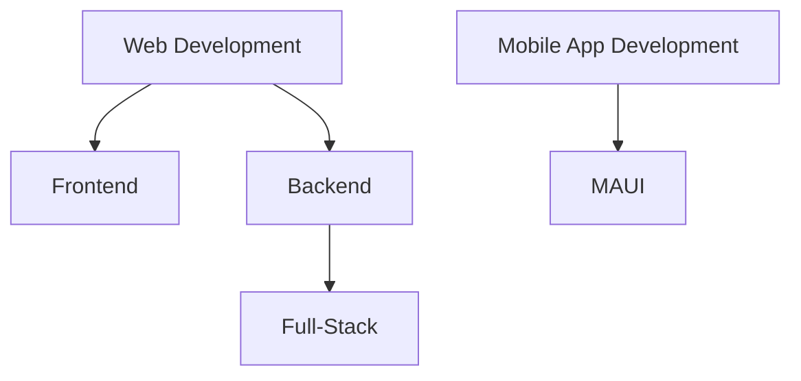

## Hello there 👋! Welcome!

Hello! My name is Tegas Aziz (WilloIzCitron)... A student from SMAN 3 North Cikarang (Why not?). 

Also I'm interested about electronics, software and others.

## Experience Training

## Stats

> **Level 1 | Programming Language Understanding**
> 
> *You only know 1-4 Programming Languages, but with limited resources/knowledge*
> 
> *Experienced Languages: Java, C++/C/C# (Python, Javascript)*

> **Level 1 | Electronics**
> 
> *You know the basic of electrical also able to use any tools, such as soldering iron*
>

> **Level 0 | Web Development**
> 
> *Able to create website. it could access Programming Language Understanding Level 2, after you experienced HTML, CSS and JS*
>
> *Undergo Training..*

### Other stats

